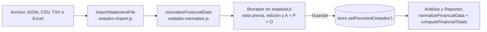

# Arquitectura

Referencia de la estructura real del código (rama `core`, septiembre de 2026). Si cambias la estructura, las rutas o la forma de los datos, actualiza este archivo en el mismo PR. Donde este archivo y el README no coinciden, manda este archivo.

## Resumen

- Aplicación de una sola página sin framework ni build. `index.html` carga Chart.js 4.4.1 desde jsDelivr y luego `js/app.js` como ES module.
- Router por hash (`#/estados`): `app.js` define un objeto `routes`. Cada ruta llama a `init<Modulo>()`, que dibuja la página dentro de `<div id="page-<ruta>">`.
- Estado global en `js/store.js`, guardado en `localStorage` con la clave `gfo-toolkit-data`.
- No hay backend, cuentas de usuario ni envío de datos: todo queda en el navegador.

## Estructura

```
index.html                 Estructura de la página, barra lateral y un <div class="page"> por ruta
css/                       variables.css, base.css, components.css, pages.css
js/
├── app.js                 Router, tema claro/oscuro, menú móvil, página de inicio y glosario
├── store.js               Estado global y persistencia
├── components/            chart.js, modal.js, tabla.js, toast.js
├── utils/
│   ├── calculate.js       Fórmulas financieras puras (catálogo en dominio-financiero.md)
│   ├── format.js          formatCurrency, formatNumber, formatPercent, formatPercentRaw, parseNumber
│   ├── html.js            escapeHTML
│   ├── form.js            leerNumero, nuevoId, fechaHoy (formularios de los módulos nuevos)
│   ├── estados-guardados.js  estadosGuardados, totalesPeriodo (estados guardados para otros módulos)
│   └── export.js          exportJSON, exportCSV, exportHTML, importJSON
└── modules/
    ├── presupuesto/       Módulo 1: presupuesto personal
    ├── estados/           Módulo 2: importación, edición y validación de estados financieros
    ├── analisis/          Módulo 3: AH, AV, razones, CNT/CNO, EOAF, EFE, DuPont e interpretación
    ├── activos/           Módulo 4: activos del hogar y depreciación
    ├── mercados/          Módulo 5: glosario, comparador de bonos y acciones, quiz
    ├── integracion/       Módulo 6: dashboard y exportación (ruta #/reportes)
    ├── apalancamiento/    GAO, GAF y GAT desde los estados guardados
    ├── inventario/        Control básico de inventario: existencias, valor, kardex y reposición
    ├── equilibrio/        Punto de equilibrio y C-V-U con escenarios y gráfica
    ├── flujo/             Flujo de efectivo por actividades (método directo)
    ├── planeacion/        Presupuesto maestro: ventas, compras, CBV, gastos, caja y resultados
    ├── proforma/          Proforma y reporte integrado con alertas
    └── inicio/            Ruta #/home: panorama general de la empresa y bloque de finanzas personales
scripts/                   dev-server.cjs y datos de ejemplo (sample-estados.csv y .json)
tests/unit/                Tests de Vitest
docs/                      Documentación: contexto, reglas, planificación, API y manual
```

### Estado real de cada módulo

| Módulo | Dónde está la lógica | Notas |
|---|---|---|
| `estados/` | `index.js` (demo, lectura del `store`, `initEstados`), `estados-ui.js` (interfaz), `estados-import.js` (archivos), `estados-normalize.js` (validación), `estados-calculations.js` (tipos y totales) | Único módulo que ya sigue el patrón completo |
| `analisis/` | `index.js` (AH, AV, razones, CNT/CNO, EFE, DuPont, interpretación e interfaz de las pestañas) y `eoaf-calculations.js` (lógica pura del Estado de Origen y Aplicación) | `ah.js`, `av.js`, `razones.js`, `dupont.js`, `cnt-cno.js`, `eoaf.js` y `efe.js` solo reexportan funciones de `index.js` |
| `presupuesto/`, `activos/`, `mercados/`, `integracion/` | Casi todo en `index.js` | `glosario-data.js`, `comparador.js` y `quiz.js` reexportan datos de `mercados/index.js` |
| `apalancamiento/` | `index.js` (lee el `store` e `initApalancamiento`), `apalancamiento-ui.js` (interfaz), `apalancamiento-calculations.js` (derivación pura, sin DOM ni `store`) | Lee los estados con `computeFinancialTotals` y `resolveAccountType`; las fórmulas están en `calculate.js` |
| `inventario/`, `equilibrio/`, `flujo/`, `planeacion/`, `proforma/` | Mismo patrón que `apalancamiento/`: `<modulo>-calculations.js` puro, `<modulo>-ui.js` que recibe `page` y `{ datos, guardar, graficar? }`, e `index.js` que lee el `store` | Plan en `docs/planificacion/modulos-guia/`. `proforma/` no guarda datos: reúne los resultados de los demás con sus mismas funciones |

Estos archivos están vacíos (devuelven `{}`) y ningún módulo los usa: `activos/activos-ui.js`, `analisis/analisis-ui.js`, `integracion/dashboard.js`, `integracion/export.js`, `mercados/mercados-ui.js`, `presupuesto/presupuesto-ui.js` y `presupuesto/presupuesto-calculations.js`. `activos/depreciacion.js` solo envuelve una función de `calculate.js`. No agregues lógica en ellos sin acordarlo: hoy nadie los importa.

## Rutas

| Ruta | Contenedor | Función | Archivo |
|---|---|---|---|
| `#/home` | `page-home` | `initHome` | `js/app.js` |
| `#/presupuesto` | `page-presupuesto` | `initPresupuesto` | `js/modules/presupuesto/index.js` |
| `#/estados` | `page-estados` | `initEstados` | `js/modules/estados/index.js` |
| `#/analisis` | `page-analisis` | `initAnalisis` | `js/modules/analisis/index.js` |
| `#/activos` | `page-activos` | `initActivos` | `js/modules/activos/index.js` |
| `#/mercados` | `page-mercados` | `initMercados` | `js/modules/mercados/index.js` |
| `#/reportes` | `page-reportes` | `initReportes` | `js/modules/integracion/index.js` |
| `#/glosario` | `page-glosario` | `initGlosario` | `js/app.js` |
| `#/apalancamiento` | `page-apalancamiento` | `initApalancamiento` | `js/modules/apalancamiento/index.js` |
| `#/inventario` | `page-inventario` | `initInventario` | `js/modules/inventario/index.js` |
| `#/equilibrio` | `page-equilibrio` | `initEquilibrio` | `js/modules/equilibrio/index.js` |
| `#/flujo` | `page-flujo` | `initFlujo` | `js/modules/flujo/index.js` |
| `#/planeacion` | `page-planeacion` | `initPlaneacion` | `js/modules/planeacion/index.js` |
| `#/proforma` | `page-proforma` | `initProforma` | `js/modules/proforma/index.js` |

Cada vez que se entra a una ruta, su `init` vuelve a dibujar la página completa.

Para agregar una ruta:

1. Crea `js/modules/<modulo>/index.js` con `export function init<Modulo>()`.
2. En `js/app.js`, importa la función y agrega la entrada en `routes`.
3. En `index.html`, agrega `<div class="page" id="page-<ruta>"></div>` dentro de `<main>` y un enlace `<a href="#/<ruta>" class="nav-link" data-route="<ruta>">` en la barra lateral.
4. Si corresponde, agrega una tarjeta en `initHome` (`js/app.js`).

`app.js` e `index.html` son compartidos: agrega al final y no reordenes lo existente.

## Flujo de datos de los estados financieros



- Importación: tabla ancha (`Estado`, `Grupo`, `Cuenta`, `Clasificacion` y una columna por periodo) o larga (`Periodo`, `Estado`, `Grupo`, `Cuenta`, `Clasificacion`, `Importe`). La columna `Cuenta` es obligatoria. En Excel, cada hoja puede ser un estado o un grupo.
- Clasificación: si una fila no trae `Clasificacion`, el tipo se infiere por el nombre (`inferAccountType`). Si no se reconoce, la importación se detiene con un error que indica la fila. Los tipos válidos están en `dominio-financiero.md`.
- Importes: acepta separadores de miles, `C$`, paréntesis y signo al final como negativo. Una celda vacía omite la cuenta en ese periodo; no la convierte en 0. El separador decimal se elige (`auto`, `.` o `,`); en `auto` se deduce de toda la tabla con `inferDecimalStyle` y, si no hay evidencia, se usa el punto decimal y se avisa de los importes ambiguos (`45.000`). D-019.
- Límites: 5,000 filas, 120 columnas y 20,000 importes por archivo; 100 periodos y 200 cuentas por grupo en cualquier formato.
- Plantilla: botón "Descargar plantilla CSV" en Estados (`tabularTemplateCSV`). Ejemplos en `scripts/sample-estados.csv` y `scripts/sample-estados.json`.
- Nada se guarda hasta que el usuario presiona Guardar. Si el guardado falla, los datos anteriores quedan intactos.

## Datos guardados (`store`)

Secciones de `defaultData` en `js/store.js`:

| Clave | Contenido |
|---|---|
| `presupuesto` | `ingresoMensual` (total de `ingresos`), `metaAhorro`, `mesesDisponibles`, `gastos[]`, `semanas[]`, `ingresos[]` (`{ concepto, monto, tipo: 'regular' \| 'ocasional' }`) |
| `estados` | Estados financieros (forma abajo) |
| `analisis` | `resultados` (sin uso actual) |
| `activos` | `inventario[]` |
| `mercados` | `quizScore`, `quizHistory[]` (sin uso actual) |
| `apalancamiento` | `comportamiento` (por cuenta: `{ tipo: 'variable' \| 'fijo' \| 'mixto', pctVariable }`), `dap` (por periodo) y `tasaDefecto` (`null` = 30 %) |
| `inventario` | `productos[]` (`{ id, nombre, unidad, existenciaInicial, costoUnitario, stockMinimo }`) y `movimientos[]` (`{ id, productoId, fecha, tipo: 'entrada' \| 'salida', cantidad, concepto }`) |
| `equilibrio` | `precio`, `costoVariableUnitario`, `costosFijos`, `unidades`, `utilidadObjetivo` (`null` = sin dato) y `escenario` (cambios en fracción: `{ precio, costoVariable, costosFijos, volumen }`) |
| `flujo` | `saldoInicial`, `periodoBase` (periodo del balance del que salió el saldo, o `''`) y `movimientos[]` (`{ id, concepto, actividad: 'operacion' \| 'inversion' \| 'financiamiento', tipo, monto }`) |
| `planeacion` | `supuestos`: `null` hasta configurarlos; claves en `SUPUESTOS` (`planeacion-calculations.js`) más `tipoPeriodo`, `periodos`, `ventasUnidades[]`, `otrosDesembolsos[]`, `productoInventario` y `stockMinimo` |
| `razonesMercado` | `periodos`: por periodo `{ acciones, precio, dividendos }` (`null` = sin dato), para las razones de mercado de Análisis |
| `theme` | `'light'` o `'dark'` |

Forma de `estados`:

```js
{
  name: 'MUNO MODA S.A.',
  periods: ['2023', '2024'],                 // del más antiguo al más reciente
  balanceGeneral: {
    '2024': {
      activos: { 'Efectivo': 52000, 'Depreciacion Acumulada': -116475 },
      pasivos: { 'Cuentas por Pagar': 92000 },
      patrimonio: { 'Capital Social': 300000 }
    }
  },
  estadoResultados: {
    '2024': { 'Ventas': 920000, 'Costo de Ventas': 545000 }
  },
  accountTypes: {                            // tipo de cada cuenta, compartido por todos los periodos
    activos: { 'Efectivo': 'efectivo', 'Depreciacion Acumulada': 'depreciacionAcumulada' },
    pasivos: { 'Cuentas por Pagar': 'cuentasPorPagar' },
    patrimonio: { 'Capital Social': 'patrimonio' },
    estadoResultados: { 'Ventas': 'ventas', 'Costo de Ventas': 'costoVentas' }
  }
}
```

API del `store`:

| Método | Uso |
|---|---|
| `get('estados.periods')` | Lee por ruta con puntos |
| `set('presupuesto.gastos', valor)` | Escribe y guarda; ignora los errores de `localStorage` |
| `setPersisted('estados', valor)` | Reemplaza una sección de primer nivel. Si `localStorage` falla, lanza un error y no cambia nada en memoria |
| `getAll()` | Copia profunda de todo el estado |
| `reset()` | Vuelve a los valores iniciales |
| `subscribe(fn)` | Avisa cada cambio; devuelve la función para desuscribirse |

Un módulo nuevo que guarde datos necesita su sección en `defaultData`, porque `setPersisted` rechaza claves que no existan ahí. Es un cambio en un archivo compartido: avísalo en el PR.

## Componentes

| Archivo | Exporta |
|---|---|
| `components/toast.js` | `showToast(mensaje, tipo = 'info', duracion = 3000)` |
| `components/modal.js` | `showModal(titulo, bodyHTML, footerHTML = '')` |
| `components/chart.js` | `renderChart(idCanvas, configChartJs)`, `destroyChart(id)` |
| `components/tabla.js` | `createTable(encabezados, filas, opciones = {})` |

`toast.js` y `modal.js` buscan sus contenedores en el DOM al cargarse. Por eso la lógica que se prueba en Node no debe importarlos: mantenla en archivos sin DOM.

## Dependencias externas

| Dependencia | Cómo se carga | Nota |
|---|---|---|
| Chart.js 4.4.1 | `<script>` de jsDelivr en `index.html` | Global `Chart` |
| SheetJS (xlsx) 0.18.5 | jsDelivr, bajo demanda al abrir un .xlsx o .xls (`estados-import.js`) | Versión con vulnerabilidades conocidas al leer archivos manipulados. Pendiente: actualizar a una versión del CDN oficial de SheetJS |
| Vitest y ESLint | `devDependencies` en `package.json` | Solo para tests y lint; la app no los necesita |

## Deuda técnica conocida

No la corrijas dentro de otra tarea: abre una rama propia y avísalo al equipo.

- `store.load()` y `store.reset()` copian `defaultData` de forma superficial, así que `reset()` puede no limpiar datos anidados.
- La demo MUNO MODA ya cuadra y trae intereses e IR (antes el activo quedaba por debajo de pasivo + patrimonio por C$ 70,200 y C$ 46,150). Las pruebas que copian sus cifras antiguas (`estados-calculations`, `apalancamiento-*`) siguen usando su propia copia.
- Las funciones originales de `calculate.js` devuelven 0 cuando el denominador es 0. La pestaña Análisis lo detecta con `computeRazones(...).denominadores`.
- `package-lock.json` está en `.gitignore`, así que cada persona puede instalar versiones distintas de Vitest y ESLint.
- `analisis/index.js` mezcla cálculo e interfaz en un solo archivo.
- `npm run lint` reporta 11 advertencias por variables sin uso.
- Conviven dos flujos de efectivo: el EFE de Análisis (indirecto, solo operación, sin depreciación) y el módulo Flujo de Efectivo (directo, tres actividades). Conviene unificarlos (D-012).
- `apalancamiento-ui.js` tiene su propio lector de números; `js/utils/form.js` (`leerNumero`) hace lo mismo para los módulos nuevos.
